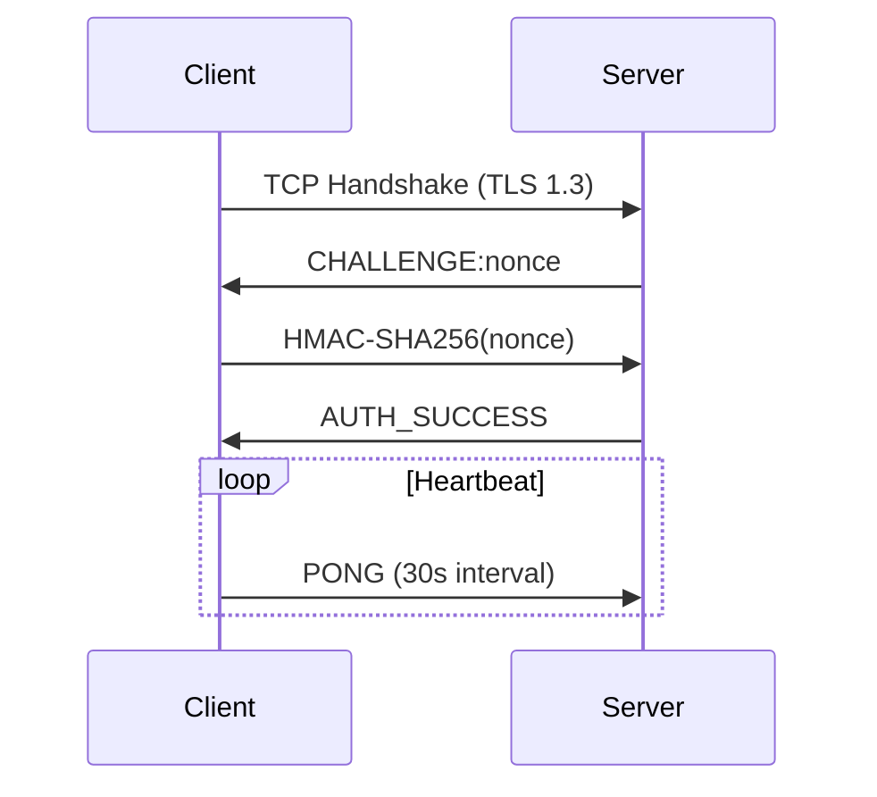
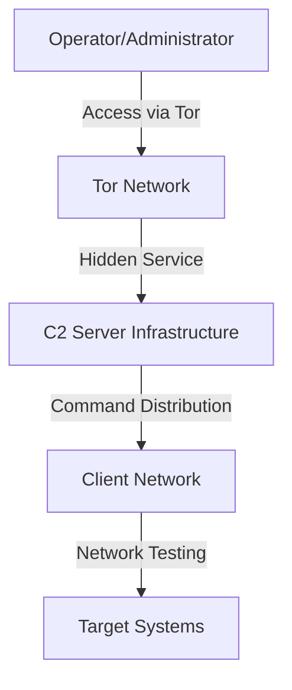
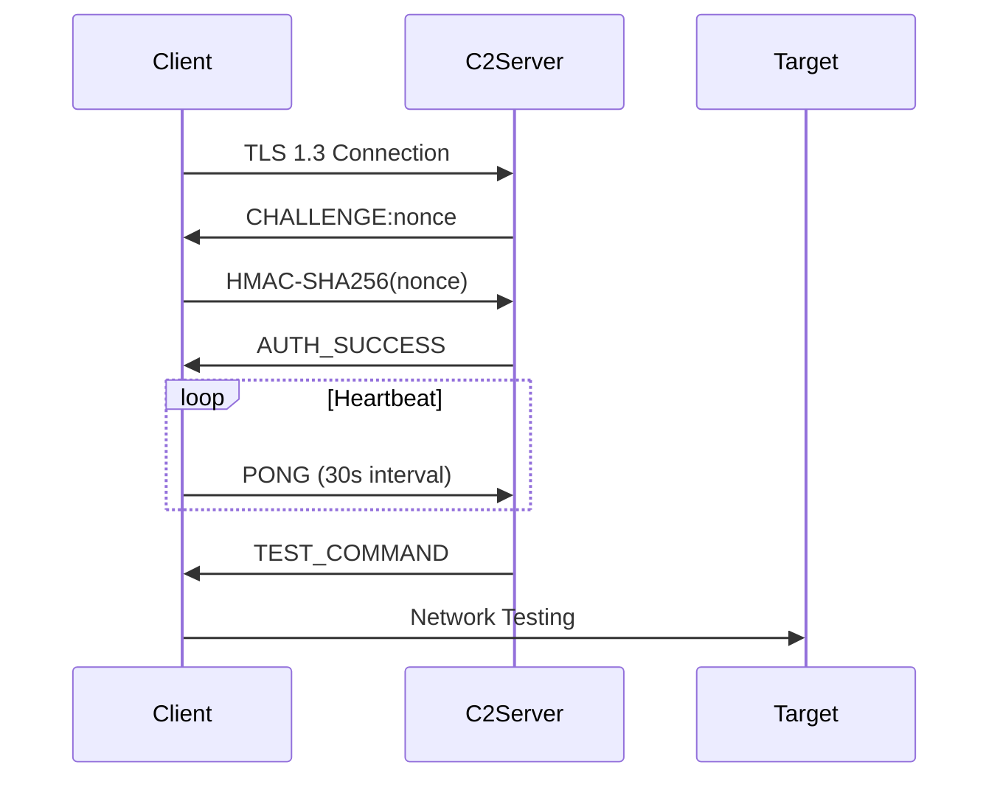
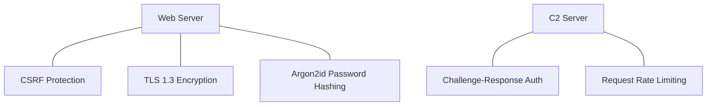
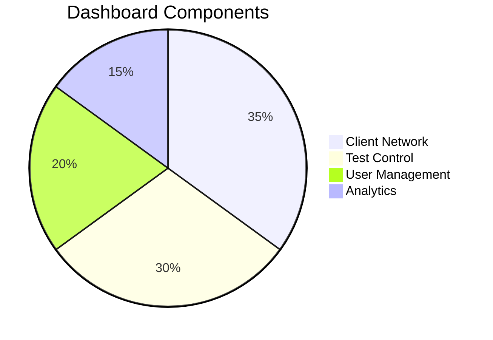
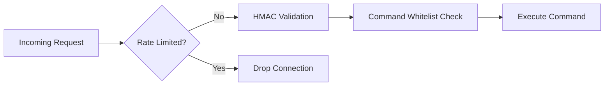

# GoTor C2 Framework

*Advanced Security Research Framework with Tor Support*

## 📌 Overview

SCREAM is a sophisticated security research platform designed for authorized penetration testing and security research. This Golang-based server features:

- **Encrypted TLS Communication** with client agents
- **Tor Hidden Service** integration for anonymous operation
- **Multi-user Role-Based Access Control**
- **Real-time Dashboard** with performance metrics
- **Multiple Network Testing Vectors** with adaptive rate limiting
- **Client Health Monitoring** with heartbeat system

> ⚠️ **Important**: This framework is intended solely for authorized security testing, educational purposes, and legitimate security research. Always obtain proper authorization before testing any system. Unauthorized use may violate laws and regulations.

## 🔥 Features

### Core Architecture

- **Asynchronous Design**: Non-blocking I/O for 10,000+ concurrent clients
- **Modular Testing System**: Pluggable test modules with runtime validation
- **Ephemeral Clients**: Auto-cleanup of stale connections
- **HMAC Challenge-Response**: For client authentication



High-Level Overview



C2 Server Components

```mermaid
graph LR
    WebServer["HTTPS Web Server\n(Port 443)"] |"Internal API"| C2Server["Command & Control Server\n(Port 7002)"]
    C2Server |"Data Storage"| Database["PostgreSQL Database"]
    TorProxy["Tor Hidden Service Proxy"] -->|"Local Forward"| WebServer
```

Client Connection Flow



Security Measures




### Network Testing Capabilities

| Method | Layer | Description | Max Duration |
|--------|-------|-------------|--------------|
| UDP Test | 4 | High-volume UDP packet testing | 3600s |
| TCP Smart | 4 | Stateful TCP session analysis | 1800s |
| GRE Test | 3 | Protocol examination with GRE packets | 600s |
| HTTP Connection Test | 7 | Partial HTTP requests with keepalive | 300s |

### Security Features

- **Argon2id Password Hashing**: 128MB memory / 4 threads
- **JWT Authentication**: 15-minute expiry with refresh
- **CSRF Protection**: Per-session tokens
- **CSP Headers**: Strict Content Security Policy
- **WebRTC Disabled**: Prevents IP leakage

## 🛠️ Installation

### Prerequisites

```bash
sudo apt install tor golang-go postgresql
```

### Setup

Generate certificates:
```bash
go run main.go -gencert
```

Configure Tor (automatically done by server):
```bash
cat > /etc/tor/torrc <<EOF
HiddenServiceDir /var/lib/tor/scream_service/
HiddenServicePort 80 127.0.0.1:443
EOF
```

## 🖥️ Dashboard Features



### Real-time Monitoring

- Client geographic distribution
- CPU/RAM utilization heatmap
- Network throughput graphs
- Packet loss metrics

### User Roles

| Role | Concurrent Tests | Methods Available | Duration Limit |
|------|-----------------|-------------------|---------------|
| Owner | 5 | All | 60 min |
| Admin | 5 | No UPDATE command | 30 min |
| Pro | 3 | Basic protocols | 10 min |
| Basic | 1 | UDP/TCP only | 5 min |

## ⚡ Quick Start

Start the server:
```bash
go build -o scream && ./scream -tor -debug
```

Access via Tor:
```bash
torify curl http://youronionaddress.onion
```

Default credentials:
```
Username: root
Password: [generated during first run]
```

## 📊 Performance Metrics

```mermaid
gantt
    title Test Lifecycle
    dateFormat  HH:mm:ss
    section Client Network
    Connection Establishment :a1, 00:00:00, 5s
    Challenge Response      :a2, after a1, 3s
    section Test
    Command Propagation     :a3, 00:00:08, 2s
    Traffic Generation      :a4, after a3, 30s
```



- Throughput: 1.2M packets/sec per client
- Latency: <200ms command propagation
- Scalability: Tested with 5,000 concurrent clients

## 🔒 Security Considerations

### Operational Security

- All traffic routed through Tor
- Server IP never exposed to clients
- Memory-safe implementations
- No persistent client identifiers

### Defensive Measures



## 🚨 Legal & Ethical Considerations

This tool is provided for **educational and authorized security testing purposes only**. It is your responsibility to:

1. Obtain proper authorization before testing any system
2. Comply with all applicable laws and regulations
3. Use this tool only in environments you own or have explicit permission to test
4. Understand that the developers assume no liability for misuse

## 📜 License

GNU General Public License v3.0
